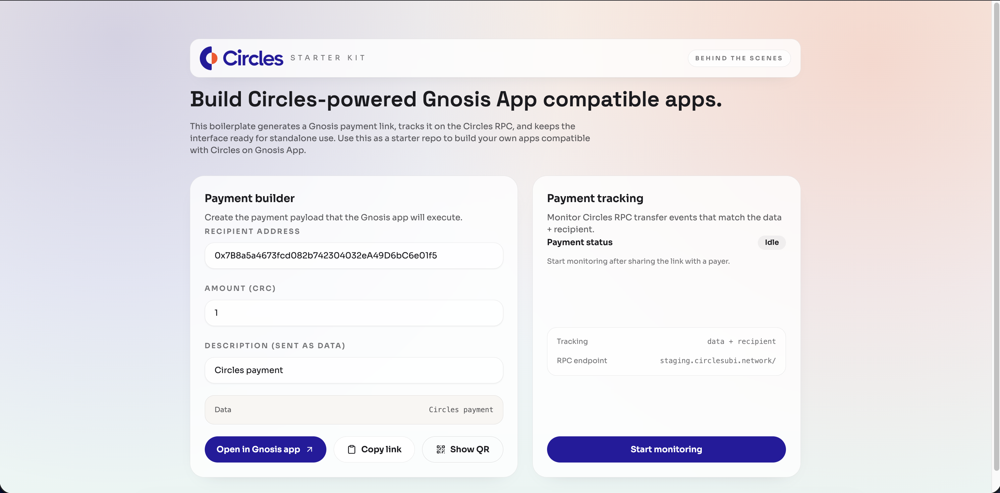
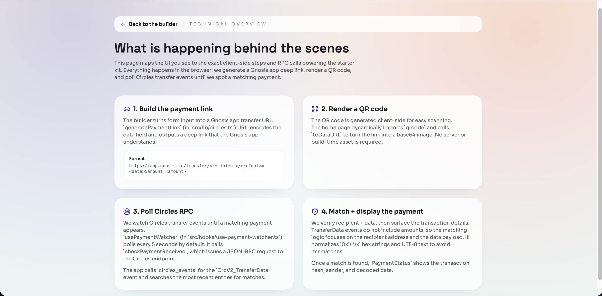

# Circles × Gnosis App Starter Kit

A mobile-first Next.js boilerplate for building Circles payment flows that open directly in the Gnosis app and verify payments via the Circles RPC.



## What’s included

- Gnosis deep link generator for CRC transfers
- Circles RPC polling for `CrcV2_TransferData`
- Mobile-first layout 

## Quickstart

```bash
npm install
npm run dev
```

## How it works

- Build a payment payload (recipient, amount, description)
- Send the description directly in the `data` field (no hash)
- Generate the Gnosis app transfer URL
- Poll Circles RPC for matching `data` values filtered by recipient address

## Customize

- `src/lib/circles.ts` for RPC + payment rules
- `src/hooks/use-payment-watcher.ts` for polling cadence
- `src/components/ui/*` for shadcn-style primitives
- `src/app/page.tsx` for the main flow
