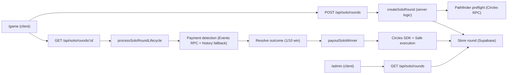

# Solo Coin Flip App 

### Full Stack Application with automated CRC payments

A one-player Circles game where users pay an entry fee in CRC, then the server resolves win/loss and sends automatic payouts on wins.


## What This App Does

- Player chooses a move (`heads` or `tails`) in `/game`
- App generates a Gnosis transfer link + QR code for entry payment
- Server verifies payment
- Round is resolved with odds:
  - win chance: `1/10`
  - lose chance: `9/10`
- On win, server sends payout from org avatar
- `/admin` shows rounds, tx hashes, payout status, and org balance

## Feature Summary

- QR-first payment UX for Circles transfers
- Payment detection via Circles `TransferData` events (events RPC)
- Fallback payment detection via transaction history
- Preflight pathfinder check before creating a round
- Automatic payout execution after win
- Safe-aware payout execution when org avatar is a Safe
- Supabase-backed round persistence (with local file fallback for dev)
- Admin dashboard with operational visibility

## Architecture (Beginner-Friendly)

The app has 3 major parts:

1. `Client pages` (`/game`, `/admin`)
2. `Server API routes` (`/api/solo/rounds`, `/api/solo/rounds/[id]`)
3. `Server domain logic` (`src/lib/server/*`)



## Project Structure

- `src/app/game/page.tsx`: player flow UI
- `src/app/admin/page.tsx`: admin/ops dashboard
- `src/app/api/solo/rounds/route.ts`: list/create rounds
- `src/app/api/solo/rounds/[id]/route.ts`: fetch + process one round
- `src/lib/server/solo-service.ts`: round lifecycle + game logic
- `src/lib/server/solo-payout.ts`: payout execution logic
- `src/lib/server/solo-store.ts`: Supabase (or local fallback) storage
- `src/lib/circles.ts`: Circles RPC helpers for payment detection
- `src/types/solo.ts`: round/payment/payout types

## Prerequisites

- Node.js 18+ (Node 20 recommended)
- npm
- A Supabase project
- A funded org setup on Gnosis/Circles:
  - org avatar address
  - private key for an owner allowed to execute payouts

## Local Setup (Step-by-Step)

1. Install dependencies

```bash
npm install
```

2. Create env file

```bash
cp .env.example .env.local
```

3. Fill `.env.local` values

```bash
# Circles RPCs
CIRCLES_RPC_URL=https://rpc.aboutcircles.com/
CIRCLES_EVENTS_RPC_URL=https://staging.circlesubi.network/
NEXT_PUBLIC_CIRCLES_EVENTS_RPC_URL=https://staging.circlesubi.network/
NEXT_PUBLIC_CIRCLES_RPC_URL=https://rpc.aboutcircles.com/
CIRCLES_CHAIN_RPC_URL=https://rpc.aboutcircles.com/

# Supabase
SUPABASE_URL=https://YOUR_PROJECT.supabase.co
SUPABASE_SERVICE_ROLE_KEY=YOUR_SERVICE_ROLE_KEY
SUPABASE_ROUNDS_TABLE=solo_rounds

# Org payout config
CIRCLES_ORG_AVATAR_ADDRESS=0x...
CIRCLES_ORG_PRIVATE_KEY=0x...

# Game economy
SOLO_ENTRY_FEE_CRC=1
SOLO_WIN_PAYOUT_CRC=2
```

4. Create database table in Supabase SQL editor

```sql
create table if not exists public.solo_rounds (
  id text primary key,
  created_at timestamptz not null,
  updated_at timestamptz not null,
  round jsonb not null
);

create unique index if not exists solo_rounds_one_active_per_player_idx
  on public.solo_rounds ((lower(round->>'playerAddress')))
  where (round->>'status') <> 'completed';
```

The unique partial index is important: it enforces at most one active (non-completed)
round per player even under concurrent API requests across multiple Vercel instances.

5. Start dev server

```bash
npm run dev
```

6. Open the app

- Player flow: `http://localhost:3000/game`
- Admin flow: `http://localhost:3000/admin`

## Environment Variables Explained

- `CIRCLES_RPC_URL`: main Circles RPC for pathfinding + balance
- `CIRCLES_EVENTS_RPC_URL`: RPC used for `TransferData` event detection
- `CIRCLES_CHAIN_RPC_URL`: chain RPC for sending payout txs
- `CIRCLES_ORG_AVATAR_ADDRESS`: org avatar receiving entry fees and paying winners
- `CIRCLES_ORG_PRIVATE_KEY`: private key for tx signing (server-only secret)
- `SOLO_ENTRY_FEE_CRC`: entry fee amount
- `SOLO_WIN_PAYOUT_CRC`: payout amount on win
- `SUPABASE_URL`: Supabase project URL
- `SUPABASE_SERVICE_ROLE_KEY`: server key used by API routes for storage
- `SUPABASE_ROUNDS_TABLE`: table name (default `solo_rounds`)

## API Reference

- `GET /api/solo/rounds`
  - returns rounds + payout config + org balance
- `POST /api/solo/rounds`
  - body: `{ "playerAddress": "0x...", "move": "heads" | "tails" }`
  - creates a new round and returns payment link
- `GET /api/solo/rounds/[id]`
  - returns one round and processes lifecycle (payment check, resolve, payout)

## Storage Behavior

- Primary: Supabase (`SUPABASE_URL` + `SUPABASE_SERVICE_ROLE_KEY`)
- Fallback: local `data/solo-rounds.json` when Supabase envs are missing

For Vercel production, configure Supabase envs so data is shared across instances.

## Deployment (Vercel)

1. Push repo to GitHub
2. Import project in Vercel
3. Add all env vars from `.env.example`
4. Ensure Supabase table exists
5. Deploy

Recommended: set all env vars for `Production` and `Preview` explicitly.

## Scripts

- `npm run dev`: start local development server
- `npm run build`: production build
- `npm run start`: run production server
- `npm run lint`: lint checks
